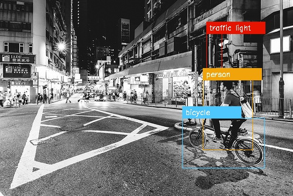

# Play Multi-objects Detection on Flickr images

Model trained on MS COCO 2014, 80 classes.  
Original source: https://github.com/experiencor/keras-yolo2  
 
Demo: https://youtu.be/x7JFWPNRGSA

### Some detected images

